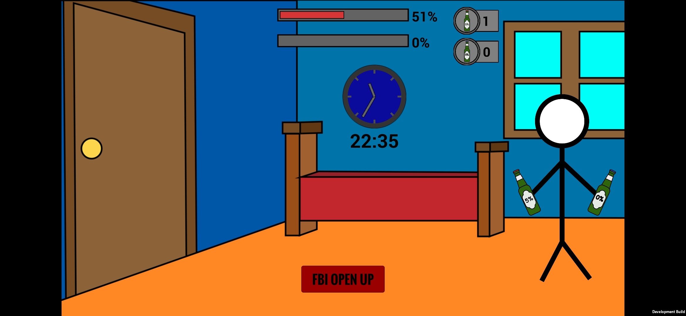

# Friday
This is 2D game about drinking beer with firends created in Unity. Your goal is to drink all beers and don't get caught by your parents. It's seem to be a clicker with level system.

This game was suposed to be a small project before matura exam. Lack of time and lack of ideas to develeop it lead me to abandon this project. 

# ToDo
- shop with new items and multipliers
- adverts
- better "parents" system

 
